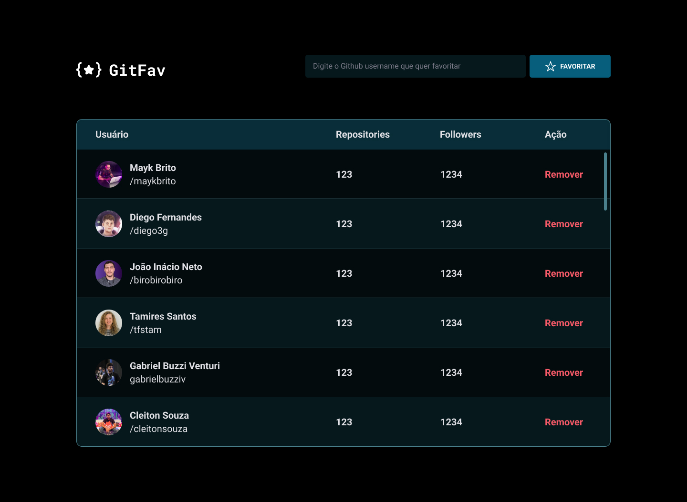

<h1 align="center"> GitFav</h1>

Repositório criado a partir do desafio GitFav do Stage 06 da turma 09 do explorer, o objetivo aprimorar a estilização do desafio Github Favorites, criando uma página que se conecta com a api do Github.  

  <a href="#technologies">Technologies</a>&nbsp;&nbsp;&nbsp;|&nbsp;&nbsp;&nbsp;
  <a href="#project">Project</a>

 

  

## 🚀 Technologies

Esse projeto foi desenvolvido com as seguintes tecnologias:

- HTML e CSS
- JavaScript
- Git e Github
- Figma

## 💻 Project

O projeto consiste em uma página onde o usuário poderá consultar um usuário do Github e terá o retorno dos seguintes dados: nome, usuário, número de repositórios e número de seguidores.

- [Visite o projeto online](https://gitfav-raulrodmo.netlify.app/)

## 🔖 Layout

Você pode visualizar o layout do projeto através [DESSE LINK](https://www.figma.com/file/SzQA07HwmSPj4hOYgu1Pps/%5BDesafios-Explorer%5D-GitFav/duplicate). É necessário ter conta no [Figma](https://figma.com) para acessá-lo.

---

Made with 💜 by raulrodmo

